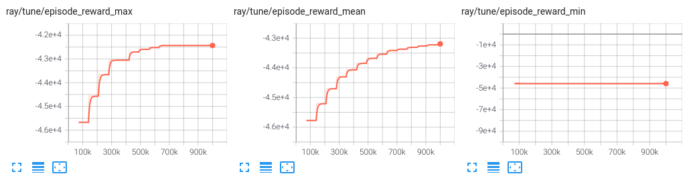

[](https://github.com/airboxlab/rllib-energyplus/actions/workflows/tests.yml)

# EnergyPlus environments for Reinforcement Learning

This project implements a gym environment that handles [EnergyPlus](https://energyplus.net/) simulations
for Reinforcement Learning (RL) experiments, using the EnergyPlus Python API.
It also provides a set of examples and tools to train RL agents.

Requires Python 3.8+, EnergyPlus 9.3+

## Setup

### Using docker image

Look for a pre-built docker image in [packages](https://github.com/airboxlab/rllib-energyplus/pkgs/container/rllib-energyplus) and follow instructions to pull it.

Alternatively, build the docker image:

```shell
docker build . -f docker/Dockerfile -t rllib-energyplus
```

Run the container

```shell
docker run --rm --name rllib-energyplus -it rllib-energyplus
```

Notes:

- Remove `--rm` to keep the container after exiting.
- If you want to use tensorboard, start the container with `--network host` parameter.
- If you want to use a GPU, start the container with `--gpus all` parameter.

Inside the container, run the experiment

```shell
cd /root/rllib-energyplus
poetry run
```

### Using virtual environment

#### Install Poetry

```shell
curl -sSL https://install.python-poetry.org | python3 -
```

See more installation options [here](https://python-poetry.org/docs/#installation).

#### Package dependencies

This project comes with a `pyproject.toml` file that lists all dependencies.
Packages versions are pinned (in `poetry.lock`) to ensure reproducibility.

```shell
poetry install
```

#### Path dependencies

This project depends on the EnergyPlus Python API. An auto-discovery mechanism is used to find the API,
but in case it fails, you can manually add the path to the API to the `PYTHONPATH` environment variable
using the following:

````shell

Add EnergyPlus folder to `PYTHONPATH` environment variable:

```shell
export PYTHONPATH="/usr/local/EnergyPlus-23-2-0/:$PYTHONPATH"
````

Make sure you can import EnergyPlus API by printing its version number

```shell
$ python3 -c 'from pyenergyplus.api import EnergyPlusAPI; print(EnergyPlusAPI.api_version())'
0.2
```

## Run example

Run the amphitheater example with default parameters using Ray RLlib PPO algorithm:

```shell
python3 rleplus/train/rllib.py --env Amphitheater
```

Example of episode reward stats obtained training with PPO, 1e5 timesteps, 2 workers, with default parameters + LSTM, short E+ run period (2 first weeks of January).
Experiment took ~20min.



## Creating a new environment

To create a new environment, you need to create a new class that inherits from `rleplus.envs.EnergyPlusEnv`
and implement abstract methods. See existing environments for examples.

Once your environment is ready, it must be declared in the `rleplus.examples.registry` module, so it gets registered.

## Tracking an experiment

Tensorboard is installed with requirements.
To track an experiment running in a docker container, the container must be started with `--network host` parameter.

Start tensorboard with:

```shell
tensorboard --logdir ~/ray_results --bind_all
```
